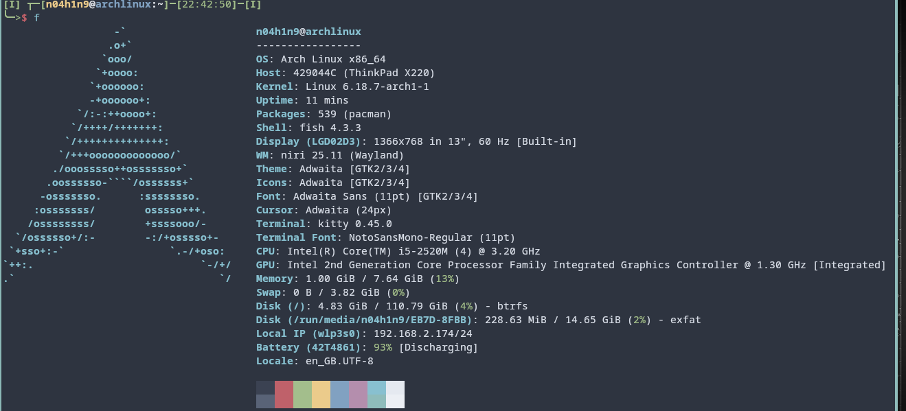

# 脚本安装和基础配置  

### 脚本安装  

arch的脚本安装其实没什么太多好讲的，但其中有些坑点，为方便抄作业和逃课，以及避免踩坑，还是写一下好一点（本人长期arch单系统，且用linux时间比用win还长，故该文档不涉及任何与win相关的东西），步骤如下：

- 准备好一个烧录ventoy的u盘，往里面复制最新的arch镜像（清华大学开源软件镜像站有，每个月一号发），找到你要装系统的的电脑，拿u盘往里怼

- 开机（或者重启），在出现电脑logo的时候按某个能让你进bios的键（按什么键自己上网搜“某某电脑进bios方法”），从中找到选择硬盘的选项，选择你用于安装系统的u盘启动

> tip:我的thinkpadx220有些特殊，按f1进bios,按f12单独选硬盘，我们进bios是为了选硬盘，所以我按f12

> 为什么你们进bios都喜欢狂摁啊，我更喜欢摁一下（逃）

- 按引导进入安装环境（没引导的地方就闭眼按回车），没多久你就能看见一个黑色的命令行界面，你可以在里面输命令

- 输入`archinstall`正式进入脚本，新版本镜像的archinstall不用你手动联网了

- 第一项显示这个脚本呈现出来的语言不用改，改了会乱码（反正也没有插你死给你改）

- 第二项改locale,enter进去改第二项locale language，改成zh_CN

- 第三项设置镜像源，下载软件用的，点进去，第一个select region选择China,第三个op开头懒得打了用来拓展你的软件仓库，如果你打游戏的话把multilib勾上，tab勾选，，其他的实验性仓库你想勾就勾，从实验性仓库下的东西一般版本更新，但更不稳定

- 第四项是最难的一步，也是很容易踩坑的一步：磁盘分区。enter进入disk configuration,继续回车可以看到三个选项，此时不推荐选第一个（推荐分区），如果不想使用更强大的回档功能的话（使用推荐分区可以回档，但会出现一些问题，也不是不能用）  

正确的方法可以看[shorin老哥的教程有关脚本安装的地方](https://www.bilibili.com/video/BV19DBqB4EY4)，我就是跟他学的（主要是我手头上也没有空电脑让我复现，而且我人又懒又怕麻烦，再重装的话前面的坑我还是会踩，反正影响不大，又不是不能回档了）

- 后面就简单了，swap那项不用动，他默认是开的。bootloader可以选默认的systemboot（轻量，单系统足够了），也可以选功能强大，教程最多的grub。
kernel（内核）通常有三个可选项：默认、lts、zen（可以多选，还有一个是服务器用的）,默认功耗低、zen性能强、lts稳定，看你自己需求。hostname（主机名）看你自己喜好，可以保持默认。再下一项设置账户和密码的话也照做就行了。再下一项profile是用来设置桌面环境和显卡驱动的，桌面环境如果是第一次用linux的话建议desktop->kde,驱动看自己显卡型号选。如果想照抄我的配置的话选minimal（这里有个坑点：显示管理器（greeter别选ly,会报错，**修复了的话issue吱我一声**）。applications可以选蓝牙和音频服务，~~蓝牙不知道~~，音频选pipe什么什么那个,下一个网络服务选iwd那个,packages的话看自己需求：

  - 如果选有zen内核或lts内核，勾上(选有哪个勾哪个)：  

  ```
  linux-zen-headers
  linux-lts-headers
  ```

  - 如果想抄我的配置：

  ```
  yazi #终端文件管理器
  alacritty #终端
  vim
  neovim
  7zip #压缩用的
  firefox #浏览器
  fcitx5-im
  fcitx-chinese-addons #这俩是输入法
  fastfetch #装逼用的,也可以拿来查看系统信息
  ```

> tip:左斜杠（/）可以进入搜索模式

最后是时区设上海（~~别找了没有北京~~，因为上海人口最多）

最后检查一遍，install,起飞！

飞机降落后（脚本运行完了后），选择第三项chroot，此时我们还要做点小修补：

1. `vim /etc/pacman.conf`配置强大的cn源，顾名思义，这是给国内用户提供便利的仓库，有了它，就不会陷入“下梯子的前提条件是有梯子”的悖论了，除此之外，大大降低了国内arch用户对梯子的依赖程度。先按大写G移动光标到底，小写o新开一行并进入编辑模式（此外，还有i和a可进入编辑模式，用途更广），此时左下角会出现---insert---字样。此时写入：

```
[archlinuxcn]
Server = https://mirrors.ustc.edu.cn/archlinuxcn/$arch
```

`pacman -Sy archlinuxcn-keyring`安装密钥就成了

1. 如果你想照抄我的配置的话，依次输入：

```
pacman -S niri paru xwayland-satellite ly noto-fonts noto-fonts-emoji way-zenhei #出选项选wlr那个
paru -S noctalia-shell #这步不行可以配完梯子先
systemctl disable --now getty@tty2.service
systemctl enable --now ly @tty2.service
```

### 基础配置

照抄我的配置的进：

- 复制我的配置文件复制到~/.config（我用的noctalia可以很轻松的配置出可用且界面干净整洁的桌面,复制我的niri配置文件后就能直接用，无需后续操作

> 复制操作可以通过命令行和基于图形界面（gui）的文件管理器（thunar挺好用的）来完成，但如果前面你全抄我的话是没装的，可以`sudo pacman -S thunar`安装(sudo用于获取管理员权限，pacman)。也可以通过命令行复制，还可以使用基于命令行界面（tui）的yazi文件管理器，前面装有的，这里是[使用教程](https://cn.x-cmd.com/pkg/yazi)

- super+t打开终端，chsh -s /usr/bin/fish把shell换成fish

- `pac`搜索软件包，搜索nwg-look、qt6ct和papirus，装上（顺带一提，这是我师傅shorin老哥做的脚本）

- 重启，来点仪式感，`reboot`重启,日后noctalia启用后可以win+alt+l打开关机重启这的那的选项

- win+z进入应用选择器，选择fcitx5配置，把中文输入法勾选，完成中文输入法配置

- 最后，`f`调用fastfetch，截屏（win+d）或拍屏，~~发给你的朋友并说`I use arch btw`~~

- 我的fastfetch



## 🎉恭喜通关🎉
